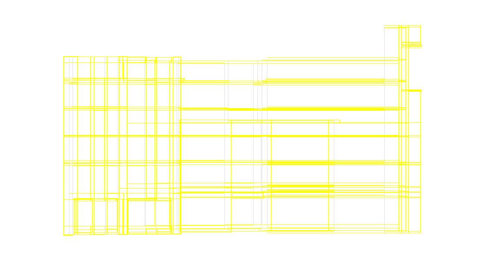
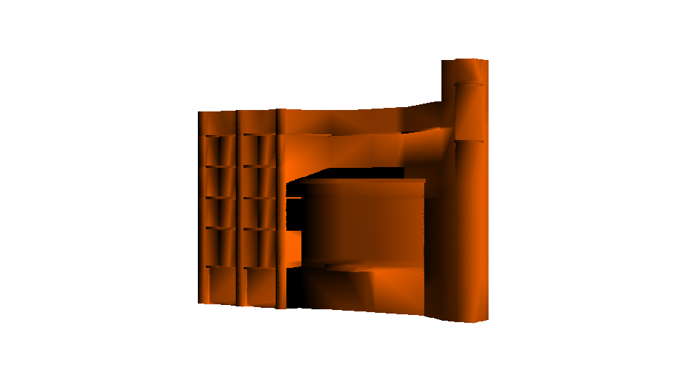
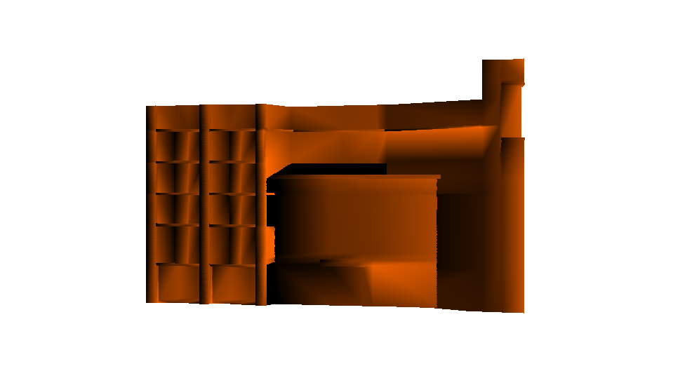
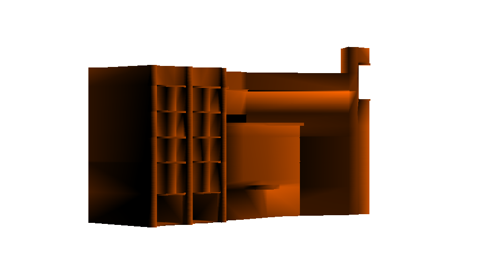
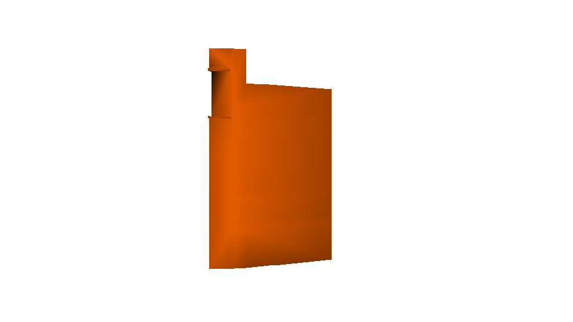
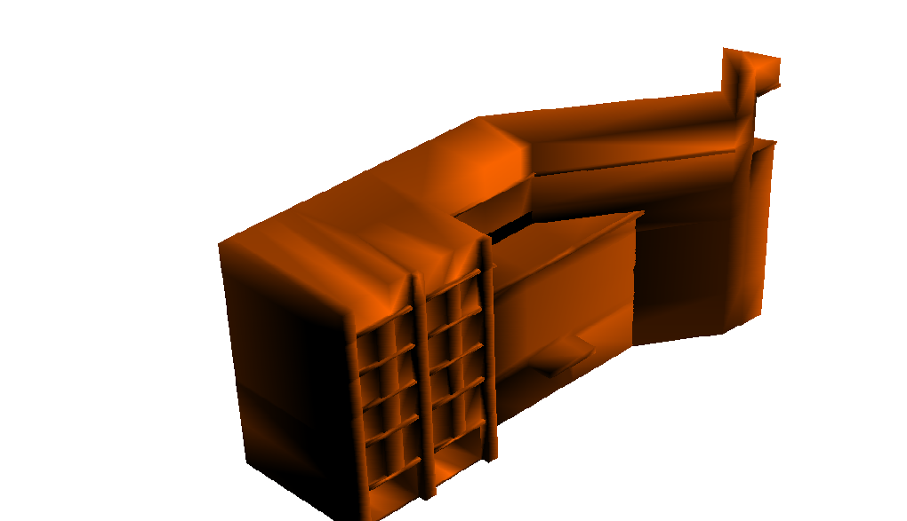

# ICTC_Model
## 5th semester Graphics project from scratch.
> This is a simple graphics project. Here we have rendered a blender prepared ICTC model.The project is written from scratch in C++ using Opengl Specification.

## Algorithms used  
1. Line drawing using points.  
2. Drawing Triangles using lines.  
3. Drawing surface and solids from the Triangles.  
4. Using Transformations.  

### Functionalities  

* Wireframe and Block model  
	* key `z` for wireframe  
	* key `x` for block  

* Camera position  
	* key `w` for z-axis decrement.  
	* key `s` for z-axis increment.  
	* key `a` for x-axis decrement.  
	* key `d` for x-axis increment.  
	* key `q` for y-axis decrement.  
	* key `e` for y-axis increment.  

* Light position  
	* key `i` for z-axis decrement.  
	* key `j` for z-axis increment.  
	* key `k` for x-axis decrement.  
	* key `l` for x-axis increment.  
	* key `u` for y-axis decrement.  
	* key `o` for y-axis increment.  

* ICTC position  
	* key `t` for z-axis decrement.  
	* key `g` for z-axis increment.  
	* key `f` for x-axis decrement.  
	* key `h` for x-axis increment.  
	* key `r` for y-axis decrement.  
	* key `y` for y-axis increment.  

* AXES angle position  
	* key `Left Arrow` for y-axis decrement.  
	* key `Right Arrow` for y-axis increment.  
	* key `Down Arrow` for z-axis decrement.  
	* key `Up Arrow` for z-axis increment.  
	* key `Page Down` for x-axis decrement.  
	* key `Page Up` for x-axis increment.  

* Scaling the ICTC  
	* key `F1` for 10% increment.  
	* key `F2` for 10% decrement.  

## Pictures
### Wireframe  

### Block  

### Sideview  

### More top view and isometric  

## Build from source

### Windows 
* Run the project in clion IDE.

### Linux  
* make sure build.sh and run.sh are executable  
* run build.sh  
* after then, always run.sh for execution  

## Executables for 64_bit architecture  
> Provided in Executables folder or can be obtained from releases.
